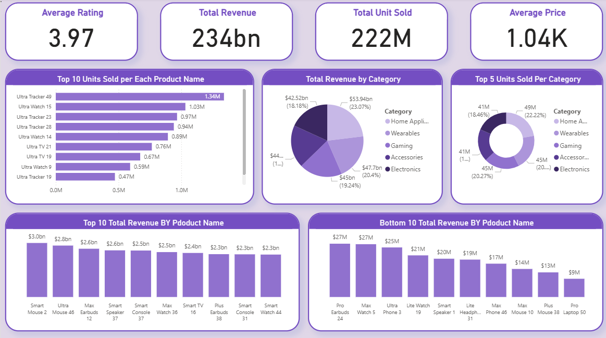

# 🟡 Power BI – Sales Performance Dashboard

### 📘 Project Overview
This project analyzes company sales performance to identify top-performing products, underperforming items, and category trends.  
It was developed during my BI training at ITI under the supervision of an experienced mentor.  
The main goal was to turn raw data into meaningful insights that could guide better business decisions.

---

### ⚠️ Business Challenge
The company lacked visibility into which products were driving most of the revenue and which ones were consistently underperforming.  
This made it difficult for stakeholders to plan marketing budgets, optimize inventory, and prioritize strategic actions.

---

### 💡 Approach
- Cleaned and prepared sales data using SQL.  
- Built a structured data model and measures in Power BI.  
- Designed a **comprehensive sales dashboard** that covers all products and categories, with focused views for the **Top 10 and Bottom 10 performers**.  
- Added interactive visuals and KPIs to track performance, profitability, and category-level contribution.  

---
### 🖼️ Dashboard Overview

This Power BI dashboard provides a complete view of sales performance across all products and regions.  
It highlights KPIs, trends, and product-level analysis to help identify where growth is coming from — and where improvements are needed.

> 💡 The layout was designed to make insights instantly clear — blending high-level KPIs with deeper product and category breakdowns for quick business decisions.

---

### 📊 Key Insights
- **Ultra Tracker 49** & **Ultra Watch 15** generated over **1M units sold each**, making them major growth drivers.  
- **Pro Laptop 50** & **Plus Mouse 38** earned less than **$15M in revenue**, indicating areas for improvement.  
- **Wearables category** led the market with **$53.9B in total revenue**, outperforming other product lines.  
- Splitting visuals into **Top 10 and Bottom 10** allowed for clearer comparisons and faster strategic insights.

---

### ✅ Recommendations
1. Focus marketing and inventory on **Wearables** and **Electronics**, where growth potential is strongest.  
2. Investigate the **low-performing products** — pricing, quality, or supply chain inefficiencies could be factors.  
3. Test **bundling weaker products** with best-sellers to drive more consistent sales across categories.  

---

### 🧰 Tools Used
- **Power BI** for dashboard creation and visualization.  
- **SQL** for data cleaning and preprocessing.  
- **DAX** for KPIs and calculated measures.  
- **Excel** for initial exploration and data formatting.

---

### 🔗 Interactive Dashboard
👉 [View on NovyPro](https://project.novypro.com/mRtIbR)

---

### 👤 Author
**Raafat Elrais**  
Business Intelligence Developer  
[LinkedIn](https://www.linkedin.com/in/raafat-elrais/)

